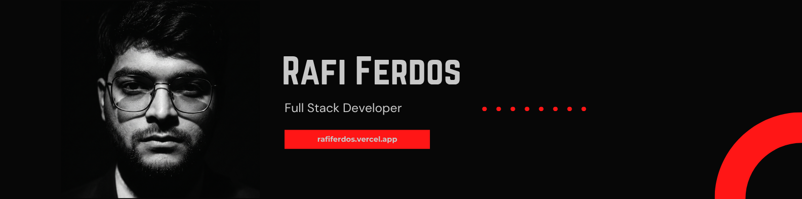

# 
⚡ ℝ𝔸𝔽𝕀 𝔽𝔼ℝ𝔻𝕆𝕊 ⚡

  

 

  

 

## 👨‍💻 About

I'm a **Full Stack Developer with 3+ years of experience** working across production web, mobile, API, and client-facing systems.

I've owned work from **requirements and architecture decisions through implementation, review, deployment, and post-release fixes**. My production work has included REST → GraphQL migrations, real-time systems with Socket.IO, React Native delivery, Next.js/PostgreSQL products, and international client projects.

I’m most useful when a product needs someone who can understand more than one layer of the system and stay accountable after the first release.

 

### A few signals from my work

- **End-to-end client ownership** — requirements, technical decisions, implementation, and deployment.
- **35+ code reviews** across shared production codebases.
- Built **real-time chat and notification flows** and migrated production integrations from REST to GraphQL.
- Earned broader frontend, backend, and mobile ownership over time, including **2 merit-based raises within 10 months**.

 

## ⚙️ How I Work

- I trace features across the **UI, API, data layer, permissions, and failure states** before changing code.
- I prefer **small, explainable changes** over unnecessary rewrites.
- I treat review, deployment, debugging, and post-release fixes as part of delivery, not somebody else's problem.
- I care about code that the **next developer can understand without reverse-engineering my decisions**.

 

## 🧩 Tech Stack

### Core

### Frontend & Mobile

### Backend & Data

### Cloud & Delivery

 

## 🚀 Selected Work

> My strongest repositories are pinned below. This is the short version of **why they exist and what they prove**.

| Project | Real-world problem | Engineering signal |
| --- | --- | --- |
| **[SpotFix](https://github.com/rafiferdos/spotfix)** | Makes finding and booking skilled technicians easier by bringing service discovery, availability, scheduling, payments, and reviews into one flow. | Multi-role product flows, booking state, payments, protected dashboards, server-state management |
| **[Lunaris](https://github.com/rafiferdos/lunaris)** | Turns interview preparation into structured assessments with reliable scoring, progress, rankings, limits, and integrity controls. | Full-stack architecture, server-owned scoring, auth, PostgreSQL, SSE, idempotency, testing, Docker |
| **[Trendora](https://github.com/rafiferdos/trendora)** | Reduces friction in buying and selling second-hand products through searchable listings and straightforward transaction flows. | Marketplace UX, authentication, REST integration, search/filtering, responsive product flows |

 

## 💼 Experience

| Role | What I was trusted with |
| --- | --- |
| **Software Developer · Sparktech Agency / BDCallingIT**   `Jul 2025 – Jun 2026` | Production web + mobile delivery, REST → GraphQL migration, Socket.IO systems, and expanding ownership across frontend, backend, and React Native. |
| **Full Stack Developer · ZenDevz**   `Nov 2024 – Feb 2025` | International client projects from requirements to deployment, Next.js/PostgreSQL delivery, and **35+ code reviews** across the team's work. |
| **Web Developer Executive · DIU Robotics Club**   `Jan 2023 – Dec 2024` | Website ownership, a custom event-registration system, and later responsibility for a dedicated web team after promotion. |

 

## 🤝 What You Can Expect From Me

I’m interested in **long-term engineering work**, not just closing isolated tickets.

For a team or client, that means learning the product and codebase properly, making decisions I can explain, shipping carefully, and staying accountable when requirements change or something needs fixing after release.

**Open to full-time software engineering roles and selected long-term client projects.**

 

  Build it carefully. Understand it fully. Stay responsible for what ships.

 

  

